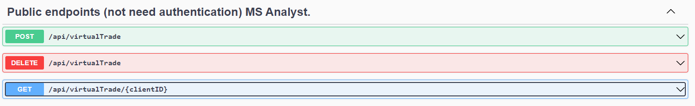
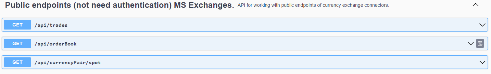

# Currency-analyst

## MS Analyst

### Microservice task:
This microservice should deal with the analysis of currencies and currency pairs. It receives the necessary
information from the Exchanges microservice via HTTP requests and AMQP.

### MS Analyst API
- http://localhost:9092/swagger-ui/index.html#/

### MS Analyst technologies:
1. Java 8;
2. Spring Boot 2.7.3;
3. Swagger;
4. JUnit 5.8.2;
5. Mockito 4.5.1;
6. Lombok 1.18.24;
7. RabbitMQ;
8. Mongo DB;

### To start MS Analyst:
1. You need to install JDK 1.8;
2. Install Rabbit MQ (default port);
3. Install Mongo DB (default port);
4. Use MS API on port 9092.

### Ports used by MS Analyst:
1. Working port - 9092;

---

## MS Exchanges

### Microservice task:
Inside this microservice, connectors to cryptocurrency exchanges are implemented, which communicate 
through public WS channels and HTTP exchange requests.

### MS Exchanges API
- http://localhost:9091/swagger-ui/index.html#/

### MS Exchanges technologies:
1. Java 8;
2. Spring Boot 2.7.3;
3. Swagger;
4. JUnit 5.8.2;
5. Mockito 4.5.1;
6. Lombok 1.18.24;
7. RabbitMQ;

### To start MS Exchanges:
1. You need to install JDK 1.8;
2. Install Rabbit MQ (default port);
3. Internet connection;
4. Use MS API on port 9091.

### Ports used by MS Exchanges:
1. Working port - 9091;
2. Port for integration testing - 9081